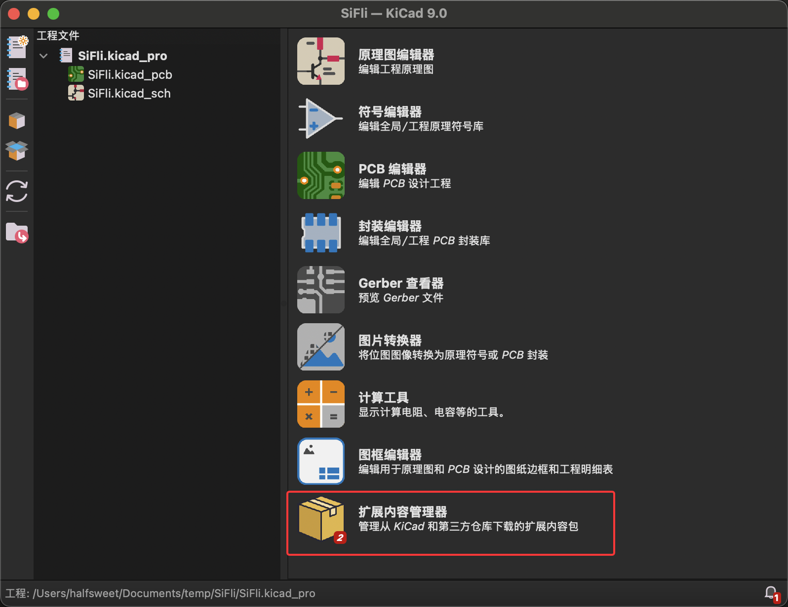
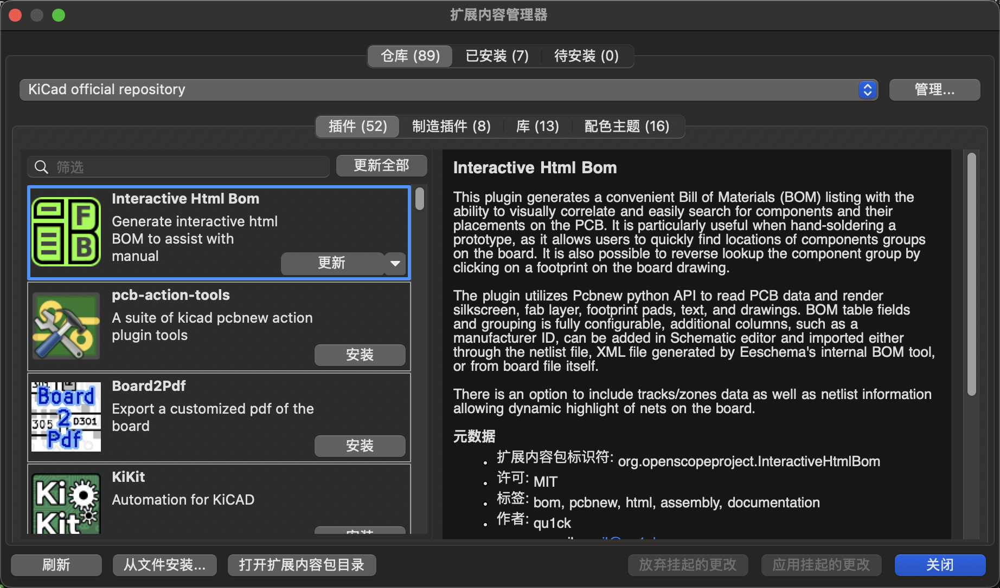
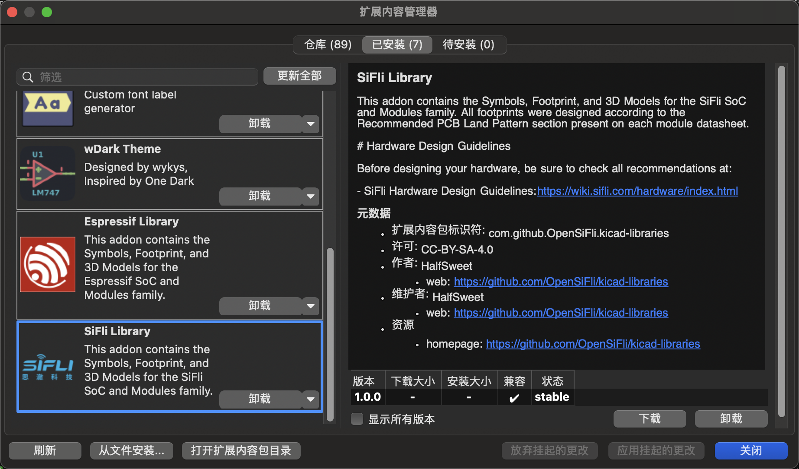

# SiFli KiCAD 库

[English](README.md) | 中文

SiFli SoC 和模组的官方 KiCAD 符号、封装和 3D 模型库。

## 📦 安装方法

### 方法一：KiCAD 拓展内容管理器（暂不支持）

1. 打开 KiCAD

2. 转到 **工具** → **拓展内容管理器**
3. 搜索 "SiFli Library"
4. 点击 **安装**

### 方法二：手动安装

1. 从 [Releases](https://github.com/OpenSiFli/kicad-libraries/releases) 下载最新版本
2. 转到 **工具** → **拓展内容管理器**

3. PCM 窗口将显示可用的插件、库和颜色主题列表。您可以浏览分类或使用搜索栏查找特定包。

4. 要使用最新版本的 ZIP 文件手动安装库，您需要从"从文件安装..."中选择文件

5. 安装包后，您将在"已安装"选项卡中看到 SiFli Library。

6. 现在您可以使用该库了。请注意，该库将在符号和封装中列为 PCM_SiFli。

## 🔧 支持的芯片

| 型号 | 封装  | 符号 | 封装 | 3D 模型 |
|-------------|-------------|--------|-----------|----------|
| SF32LB52XUx | QFN48 | ✅ | ✅ | ✅ |
| SF32LB52xUx | QFN48 | ✅ | ✅ | ✅ |

**图例：**

- ✅ 可用
- ⚠️ 即将推出  
- ❌ 不可用

## 📡 支持的模组

| 型号 | 符号 | 封装 | 3D 模型 |
|-------------|--------|-----------|----------|
| SF32LB52-MOD-1 |  ✅ | ✅ | ❌ |

**图例：**

- ✅ 可用
- ⚠️ 即将推出
- ❌ 不可用

## 📚 文档资料

- [SiFli 硬件设计指南](https://wiki.sifli.com/hardware/index.html)
- [SiFli 官方网站](https://www.sifli.com/)

## 🤝 贡献

欢迎贡献！请随时提交 Pull Request。

## 📄 许可证

此库采用 [CC-BY-SA-4.0](LICENSE) 许可证。

## 📞 技术支持

如需技术支持和咨询：

- 访问 [SiFli Wiki](https://wiki.sifli.com/)
- 在此仓库中创建 issue
- 联系：[GitHub Issues](https://github.com/OpenSiFli/kicad-libraries/issues)
