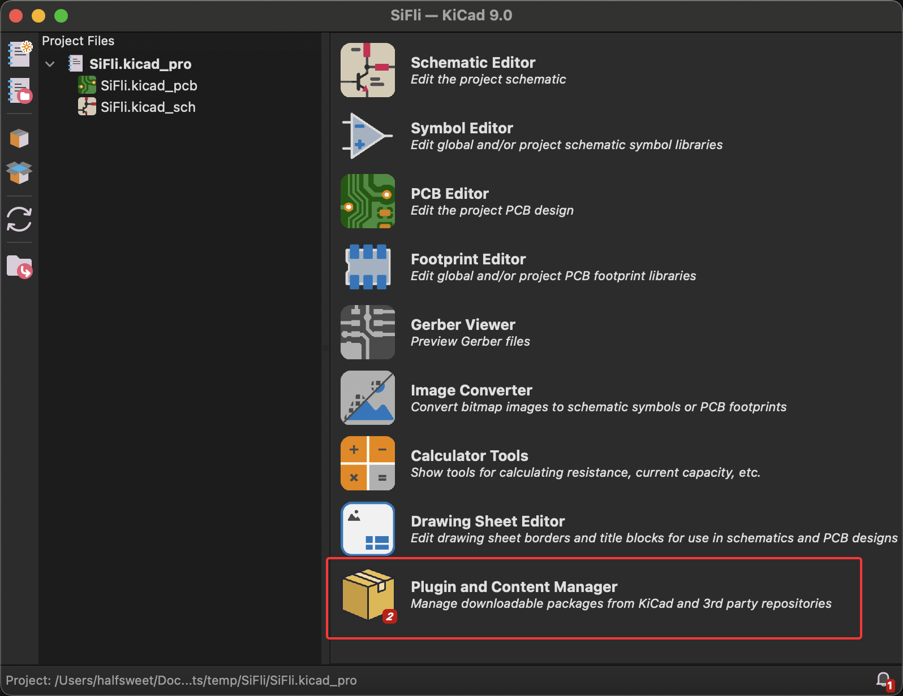
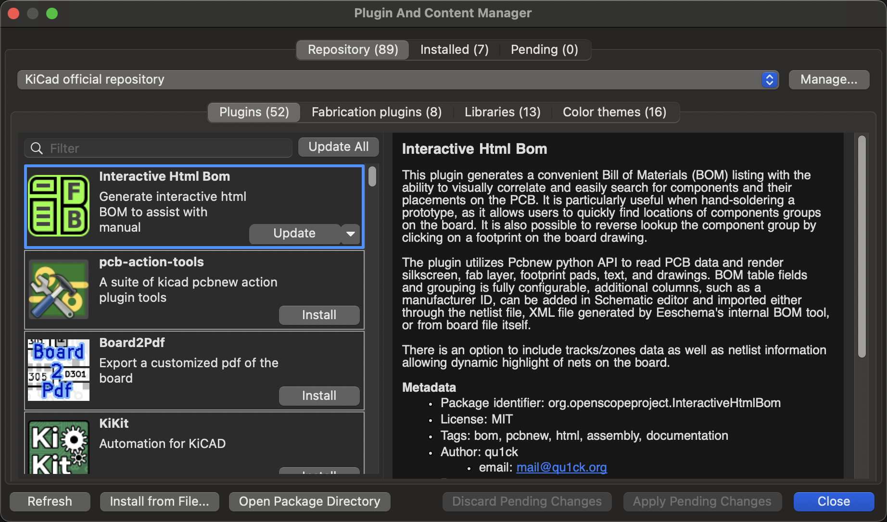
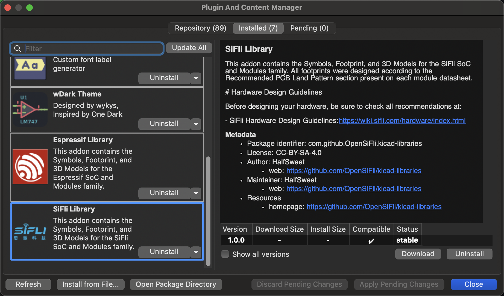

# SiFli KiCAD Libraries

English | [中文](README-zh.md)

Official KiCAD symbol, footprint and 3D model libraries for SiFli SoC and modules.

## 📦 Installation

### Method 1: KiCAD Package and Content Manager (Not yet supported)

1. Open KiCAD

2. Go to **Tools** → **Package and Content Manager**
3. Search for "SiFli Library"
4. Click **Install**

### Method 2: Manual Installation

1. Download the latest release from [Releases](https://github.com/OpenSiFli/kicad-libraries/releases)
2. Go to **Tools** → **Package and Content Manager**

3. The PCM window will display a list of available plugins, libraries, and color themes. You can browse through the categories or use the search bar to find a specific package.

4. To install the library manually using the ZIP file from the latest release, you need to select the file from "Install from file..."

5. Once the package is installed, you will see the SiFli Library listed on the Installed tab.

6. Now you are ready to use the library. Note that the library will be listed as PCM_SiFli in the Symbol and Footprint.

## 🔧 Supported Chips

| Part Number | Package  | Symbol | Footprint | 3D Model |
|-------------|-------------|--------|-----------|----------|
| SF32LB52XUx | QFN48 | ✅ | ✅ | ✅ |
| SF32LB52xUx | QFN48 | ✅ | ✅ | ✅ |

**Legend:**

- ✅ Available
- ⚠️ Coming Soon  
- ❌ Not Available

## 📡 Supported Modules

| Part Number | Symbol | Footprint | 3D Model |
|-------------|--------|-----------|----------|
| SF32LB52-MOD-1 |  ✅ | ✅ | ❌ |

**Legend:**

- ✅ Available
- ⚠️ Coming Soon
- ❌ Not Available

## 📚 Documentation

- [SiFli Hardware Design Guidelines](https://wiki.sifli.com/hardware/index.html)
- [SiFli Official Website](https://www.sifli.com/)

## 🤝 Contributing

Contributions are welcome! Please feel free to submit a Pull Request.

## 📄 License

This library is licensed under [CC-BY-SA-4.0](LICENSE).

## 📞 Support

For technical support and questions:

- Visit [SiFli Wiki](https://wiki.sifli.com/)
- Create an issue in this repository
- Contact: [GitHub Issues](https://github.com/OpenSiFli/kicad-libraries/issues)
